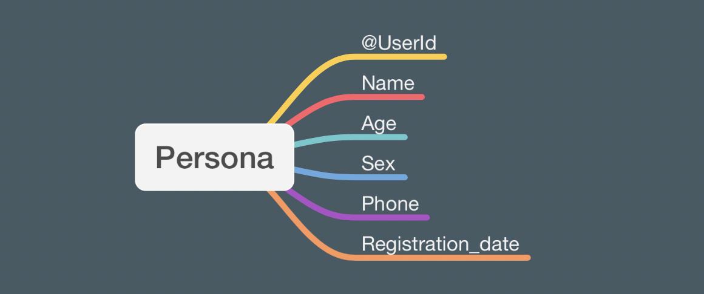
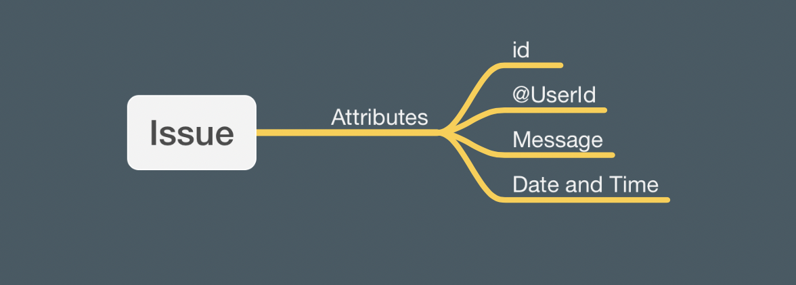
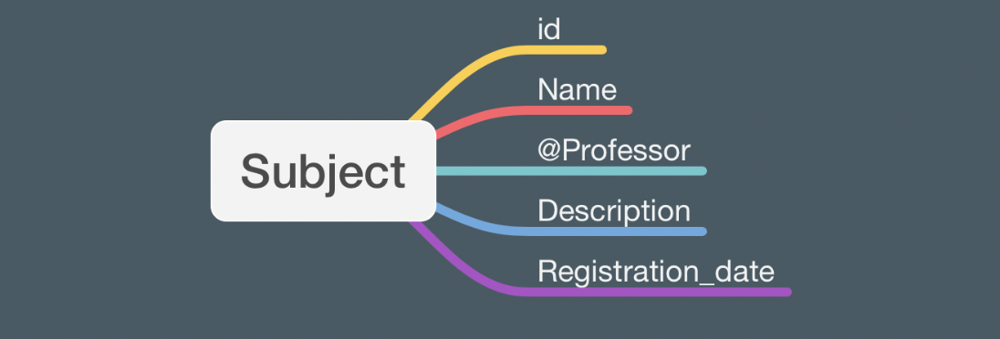
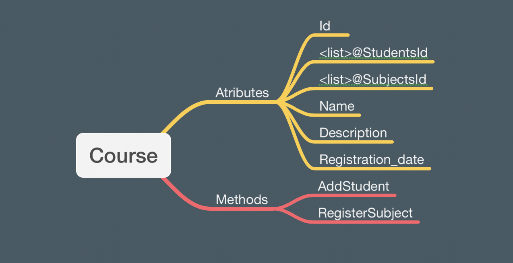

# PMI_projectwork

_**This project is intended to serve as the final project work of the subject Programming Methodology I, in which the main programming language used is Java.**_

|           | School Management System |
|-----------|--------------------------|
| Version   | 1.0                      |
| Interface | Console Application      |
| Author    | Emanuel Nzinga Maimona   |

## Goal and  Purpose
The project was built having in mind the pre-established requirements, that is, to create a console application in healthcare, education, economics or any other topic, with CRUD(Create, Read, Update and Delete) as minimal functionality of application.

In order to give the user the ability to decide, which action they want to examine and how many times, everything is organized into menus.

### User experience target
 The User has to communicate with the program via console (data input and output), manage and store element data in an XML file.

### How does this project help?
The project serves as medium to store data in an easy and quick way. As a management system, it facilitates the CRUD process, and ensures automation of some tasks related to a school system. A more precise description can be found in the subsequent lines throughout the document.

## Use
### Prerequisites
Once the application is console only, the user needs to install a java IDE and MAVEN, to be able to use it. The suggested links to the installations, based on what was used along the development of the project are:
[Git](https://git-scm.com/download/win),
[JDK](https://www.oracle.com/java/technologies/downloads/),
[Maven](https://maven.apache.org/download.cgi),
[Intellij](https://www.jetbrains.com/idea/download/#section=windows)

Once it is installed the user needs to clone the project and then run the application.

Use the login name 'AD0001' and the password 'admin' to enter into the system, and be able to use it according to your own wills.

## Functionality
The application is structured in 4 distinct menus, as follows: Login, Administration, Professor and Student menu.

### Login menu
The first menu that shows up once the application is started. It is where the user needs to input its credentials in order to have access to the subsequent menu.
If the data is input incorrectly 3 times the applications closes automatically. In case the user forgot the credentials he can request it to the administrator of the system.

### Student menu
Once you are logged in as a student, the user can:
- Consult personal data.
- Consult registered courses.
- Report an issue.
- Change your password.
- Logout.
- Exit.

### Professor Menu
Once you are logged in as a Professor, the user can:
- Consult personal data.
- Consult attributed subjects.
- Report an issue.
- Change your password.
- Logout.
- Exit.

### Administrator Menu
Here is where the magic happens, that is, the administration of the entire system is done here. The administrator has the capability to alter pretty much all stored data. He can even add new administrators and in the worst case scenario he can also delete data (which is not recommending). The administrator of the system can:
- Open an account.
- Update an account.
- Manage a Course.
- Manage a Subject.
- Consult accounts.
- Consult courses.
- Consult subjects.
- Read Professor issues.
- Read Students issues.
- Resume of the System.
- Logout.
- Exit.

# Structure
Even thought the project interface target was console application only, it was built on top of the **3 Layerd Architecture**, that is, there is a **BLL** (Business Logic Layer), **DAL** (Data access Layer) and **PL** (Presentation Layer or splash).

**Models** can be seen as elements of the Presentation Layer, to depict the main information stored in the xml File.

## User model
This is the model/class in which the login name and the password are stored.
 
- The login name is made by the first two letters which represent the category and followed by 4 numbers, which indicates the registration number. 
- The categories meaning are **AD** (Administrator), **ST** (Student) and **PR** (Professor). For example 'ST0001', represents a student with registration id 0001.

## Persona model
Here is where the personal identification data of the user is stored, as well as its correspondent @id (User id). 

## Issue model
Every Student or Professor, can write an issue or complaint to be read by the administrator of the system.

## Subject model
Here is information about the Subject is stored. By convention every subject has only one Professor.

## Course model
Course related information is stored here, that is, the Student id's and the subjects correspondent to the course.

One student or subject can be registered in different courses.

The methods in the image, correspond to the Presentation Layer, which is related to the Administrator menu (Look upwards for more details).

 # Conventions
### Structure of the XML files:
  The Xml files where stored in a way to enable efficient management of the data, that is why, each Model, has its own xml file, and with it (some xml files) are linked with some other xml files through id's.

### For the final user
- The system is made up to be able to stored **9999** users of each category, in total 29997 users can be stored without any inconsistency.
- Whenever a new user is registered, its default status is **Passive**. In case of a Professor, the status automatically changes whenever a subject is assigned to him, for Students, conversely, whenever he is registered into a course.
- All User are **advised to change their password** right away, because, for every new account, a default password is attributed to it, that is "" or (empty string), which is not secure, and it compromises the security of the system. 
-Every Student, Professor or Administrator is a Persona, and every Persona is a User.

### Future Contributions
- Add more information to the Persona, such as email, etc. 
- Add more information to the subject such as kind(Lecture or Practice using enums), how many hours per week, etc. 
- Store students grades, for each subject, in which, the correspondent professor can give a grade to a student taking his subject.
- Add course schedule generator, based on the number of registered subjects and its correspondent amount of hours per semester.
- Add duplication checker function, whenever a new subject or student is added to a course, Or in another model.
- Think, Think, think, and then, implement your own ideas :smile:

     12 April, 2022
     Maimona Emanuel Nzinga
     University of Pécs