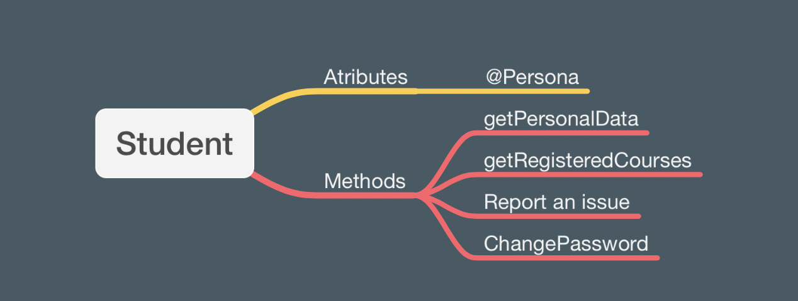
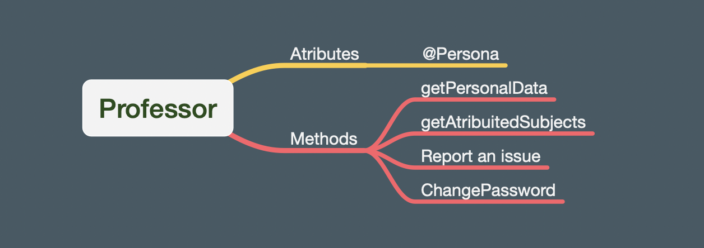
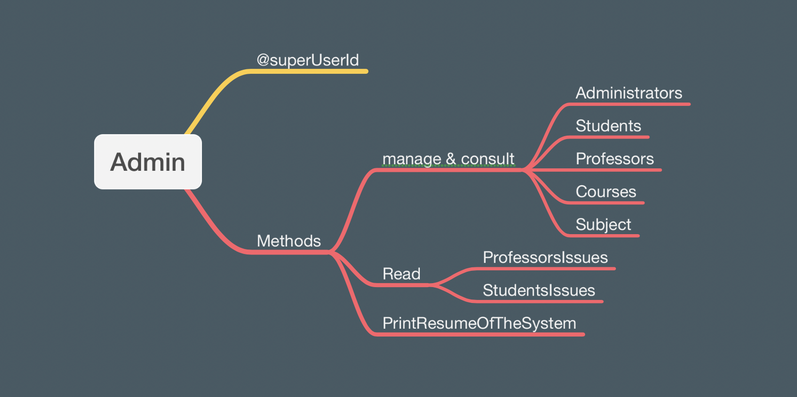

# PMI_projectwork

_**This project is intended to serve as the final project of the subject Programming Methodolgy I, in which the main programming language used is Java.**_

## Description of the project

| |  School Management System |
| ----- |------------------------|
| Version | 1.0                    |
| Author | Emanuel Nzinga Maimona |

## The goal to achieve/ Purpose
The project was built having in mind the pre-stablished requirements that is to create a console application in healthcare, education, economics or any other topic, with CRUD(Create Read Update and Delete) as minimal functionality of application.

In order to give the user the ability to decide, which action they want to examine and how many times, everything is organized into menus.

### User experience target
 The User has to communicate with the program via console (data input and output);  manage and store element data in an XML file.

### How does this project help?
The project serves as medium to store data in an easy and quick way. As a management tool, it facilitates the CRUD process, and ensures automation of some tasks related to a school system. A more precise description can be found in the subsequent lines throughout the document.

## Use
### Prerequisites
Once the application is console only, the user needs to install a java IDE and MAVEN, to be able to use it. The suggested links to the installations, based on what was used along the development of the project are:
[Git](https://git-scm.com/download/win),
[JDK](https://www.oracle.com/java/technologies/downloads/),
[Maven](https://maven.apache.org/download.cgi),
[Intellij](https://www.jetbrains.com/idea/download/#section=windows)

Once it is installed the user needs to clone project and then run the application...

## Functionality
The application is structured in 3 distinct menus, as follows: Login, Administration, Professor adn Student menu.

### Login menu
The first menu that shows up once the application is started. It is where the user needs to input is credentials in order to have access to the subsequent menu.
If the data is input incorrectly 3 times the applications closes automatically. In case the user forgot the credentials he can request it to the administrator of the system.

### Student menu
Once you are logged in as a student, the user can:
- Consult personal data.
- Consult registered courses.
- Report an issue.
- Change your password.
- Logout.
- Exit.

### Professor Menu
Once you are logged in as a Professor, the user can:
- Consult personal data.
- Consult attributed subjects.
- Report an issue.
- Change your password.
- Logout.
- Exit.

###Administrator Menu
Here is where the magic happens, that is the administration of the entire system is done here.
- Open an account.
- Update an account.
- Manage a Course.
- Manage a Subject.
- Consult accounts.
- Consult courses.
- Consult subjects.
- Read Professor issues.
- Read Students issues.
- Resume of the System.
- Logout.
- Exit.

### Terms

## Structure
#Structure of the XML files:
#Structure of the Functions files:

## Conventions:
Whenever a new user is registered, its default status is Passive. In case of a Professor, the status automatically changes whenever a subject is assigned to him, for Students, conversally, whenever he is registered into a course.

> 12 April, 2022 
> Maimona Emanuel Nzinga
> University of Pécs